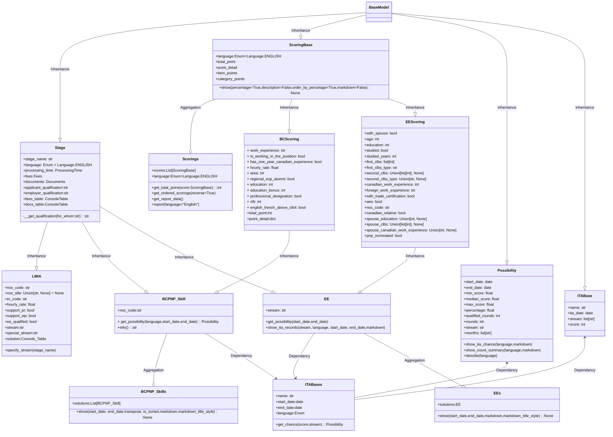

```mermaid
classDiagram
    class BaseModel
    %% #TODO: 可以直接用applicant_qualification 和 employer_qualification
    class Stage {
        +stage_name: str
        +language: Enum = Language.ENGLISH
        +processing_time: ProcessingTime
        +fees:Fees
        +documents: Documents
        +applicant_qualification:str 
        +employer_qualification:str
        -__get_qualification(for_whom:str):str
        +fees_table: ConsoleTable
        +docs_table:ConsoleTable

    }
    class ScoringBase{
        +language:Enum=Language.ENGLISH
        +total_point
        +point_detail
        +item_points
        +category_points
        +show(percentage=True,description=False,order_by_percetage=True,markdown=False):None
    }
    class BCScoring{
       + work_experience: int
       + is_working_in_the_position: bool
       + has_one_year_canadian_experience: bool
       + hourly_rate: float
       + area: int
       + regional_exp_alumni: bool
       + education: int
       + education_bonus: int
       + professional_designation: bool
       + clb: int
       + english_french_above_clb4: bool
       +total_point:int
       +point_detail:dict
    }
    class EEScoring{
        +with_spouse: bool
        +age: int
        +education: int
        +studied: bool
        +studied_years: int
        +first_clbs: list[int]
        +first_clbs_type: str
        +second_clbs: Union[list[int], None]
        +second_clbs_type: Union[str, None]
        +canadian_work_experience: int
        +foreign_work_experience: int
        +with_trade_certification: bool
        +aeo: bool
        +noc_code: str
        +canadian_relative: bool
        +spouse_education: Union[int, None]
        +spouse_clbs: Union[list[int], None]
        +spouse_canadian_work_experience: Union[int, None]
        +pnp_nominated: bool
    }
    class Possibility{
        +start_date: date
        +end_date: date
        +min_score: float
        +median_score: float
        +max_score: float
        +percentage: float
        +qualified_rounds: int
        +rounds: int
        +stream: str
        +months: list[str]
        +show_ita_chance(language,markdown)
        +show_count_summary(language,markdown)
        +descibe(language)
    }
    class ITABase{
        +name: str
        +ita_date: date
        +stream: list[str]
        +score: int
    }
    class ITABases{
        +name: str
        +start_date:date
        +end_date:date
        +language:Enum
        +get_chance(score,stream):Possibility
    }
    class EE{
        +stream: str
        +get_possibility(start_date,end_date)
        +show_ita_records( stream, language, start_date, end_date,markdown)
    }
    class EEs{
        +solutions:EE
        +show(start_date,end_date,markdown,markdown_title_style):None
    }
    class Scorings {
        +scores:List[ScoringBase]
        +language:Enum=Language.ENGLISH 
        +get_total_point(score:ScoringBase):int
        +get_ordered_scorings(reverse=True)
        +get_report_data()
        +report(language="English") 
    }
    class BCPNP_Skill{
        +noc_code:str
        + get_possibility( language,start_date,end_date):Possibility
        +info():str
    }
    class BCPNP_Skills {
        +solutions:List[BCPNP_Skill]
        +show( start_date, end_date,transpose, is_sorted,markdown,markdown_title_style):None
    }
    class LMIA{
        +noc_code: str
        +noc_title: Union[str, None] = None
        +er_code: str
        +hourly_rate: float
        +support_pr: bool
        +support_wp: bool
        +ee_qualified: bool
        +stream:str
        +special_stream:str
        +solution:Console_Table
        +specify_stream(stage_name)
    }

    BaseModel --|> Stage :Inheritance
    BaseModel --|> ScoringBase:Inheritance
    BaseModel --|> Possibility:Inheritance
    BaseModel --|> ITABase:Inheritance

    Stage --|> LMIA:Inheritance
    Stage --|> BCPNP_Skill:Inheritance

    Possibility <-- ITABases:Dependancy
    ITABase <-- ITABases:Dependancy

    ScoringBase --o Scorings:Aggregation
    ScoringBase --|> BCScoring:Inheritance
    BCScoring --|> BCPNP_Skill:Inheritance
    BCPNP_Skill --o BCPNP_Skills:Aggregation
    BCPNP_Skill --> ITABases:Dependancy

    ScoringBase --|> EEScoring:Inheritance
    Stage --|> EE:Inheritance
    EEScoring --|> EE:Inheritance
    EE --> ITABases:Dependancy
    EE --o EEs:Aggregation

```