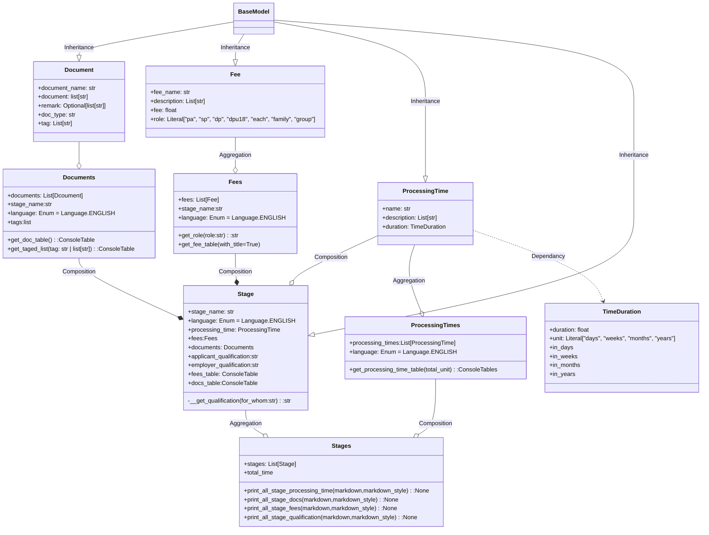

```mermaid
classDiagram
    class BaseModel

    class Stage {
        +stage_name: str
        +language: Enum = Language.ENGLISH
        +processing_time: ProcessingTime
        +fees:Fees
        +documents: Documents
        +applicant_qualification:str 
        +employer_qualification:str
        -__get_qualification(for_whom:str):str
        +fees_table: ConsoleTable
        +docs_table:ConsoleTable

    }
    class Stages {
        +stages: List[Stage]
        +total_time
        +print_all_stage_processing_time(markdown,markdown_style):None
        +print_all_stage_docs(markdown,markdown_style):None
        +print_all_stage_fees(markdown,markdown_style):None
        +print_all_stage_qualification(markdown,markdown_style):None

    }
    class ProcessingTime{
        +name: str
        +description: List[str]
        +duration: TimeDuration
    }
    class ProcessingTimes{
        +processing_times:List[ProcessingTime]
        +language: Enum = Language.ENGLISH
        +get_processing_time_table( total_unit):ConsoleTables
    }
    class TimeDuration{
        +duration: float
        +unit: Literal["days", "weeks", "months", "years"]
        +in_days
        +in_weeks
        +in_months
        +in_years
    }
    class Fee{
        +fee_name: str
        +description: List[str]
        +fee: float
        +role: Literal["pa", "sp", "dp", "dpu18", "each", "family", "group"]
    }
    class Fees{
        +fees: List[Fee] 
        +stage_name:str 
        +language: Enum = Language.ENGLISH
        +get_role(role:str):str
        +get_fee_table(with_title=True)
    }
    class Document {
        +document_name: str  
        +document: list[str]
        +remark: Optional[list[str]]
        +doc_type: str
        +tag: List[str]
    }
    class Documents {
        +documents: List[Dcoument]
        +stage_name:str
        +language: Enum = Language.ENGLISH
        +tags:list
        +get_doc_table():ConsoleTable
        +get_taged_list(tag: str | list[str]):ConsoleTable
    }

    BaseModel --|> Document:Inheritance
    BaseModel  --|> Fee:Inheritance
    BaseModel --|> ProcessingTime:Inheritance
    BaseModel --|> Stage :Inheritance


    Fee --o Fees:Aggregation
    Fees --* Stage :Composition
    
    Document --o Documents
    Documents --* Stage:Composition

    %%TODO:原来的是ProcessingTime 直接作为Stage的composition的。 Code没有修改。
    ProcessingTime --o Stage:Composition 
    ProcessingTimes --o Stages:Composition
    ProcessingTime --o ProcessingTimes:Aggregation
    ProcessingTime ..> TimeDuration:Dependancy

    Stage --o Stages:Aggregation


```