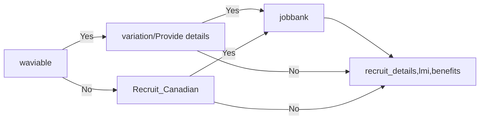

```mermaid
flowchart LR

    A[waviable] -- Yes --> B[variation/Provide details]
    A -- No --> C[Recruit_Canadian]
    B -- Yes --> D[jobbank]
    D --> E[recruit_details,lmi,benefits]
    B -- No --> E
    C -- Yes --> D
    C -- No --> E

    

```